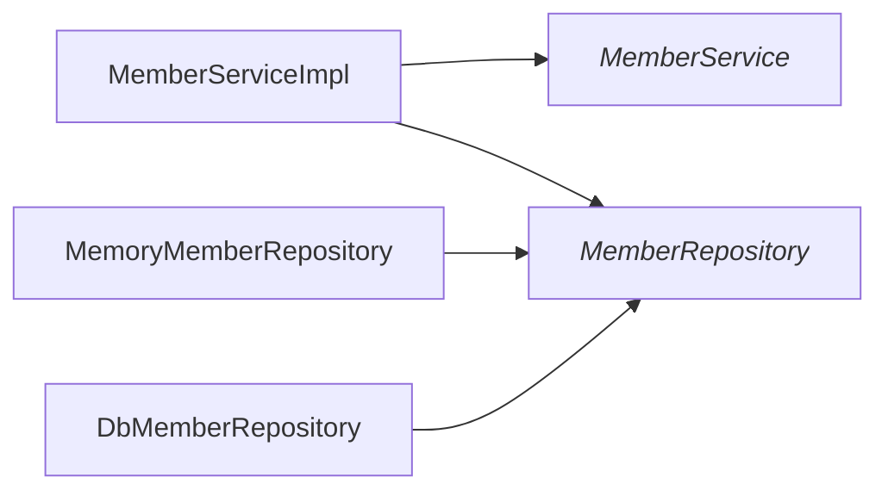
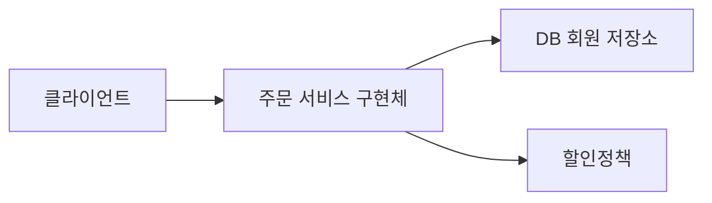

### 강의 목차

1. 객체 지향 설계와 스프링
2. 스프링 핵심 원리 이해1 - 예제 만들기
3. 스프링 핵심 원리 이해2 - 객체 지향 원리 적용
4. 스프링 컨테이너와 스프링 빈
5. 싱글톤 컨테이너와
6. 컴포넌트 스캔
7. 의존관계 자동 주입
8. 빈 생명주기 콜백
9. 빈 스코프
 
## 스프링 핵심 원리 이해1 - 예제 만들기(2021-10-25)

	- 회원
		* 회원을 가입하고 조회할 수 있다.
		* 회원은 일반과 VIP 두 가지 등급이 있다.
		* 회원 데이터는 자체 DB를 구축할 수 있고, 외부 시스템과 연동할 수 있다. (미확정)
	- 주문과 할인 정책
		* 회원은 상품을 주문할 수 있다.
		* 회원 등급에 따라 할인 정책을 적용할 수 있다.
		* 할인 정책은 모든 VIP는 1000원을 할인해주는 고정 금액 할인을 적용해달라. (나중에 변경 될 수 있다.)
		* 할인 정책은 변경 가능성이 높다. 회사의 기본 할인 정책을 아직 정하지 못했고, 오픈 직전까지 고민을 미루고 싶다. 최악의 경우 할인을 적용하지 않을 수 도 있다. (미확정)
		
		
## UML

### 회원 다이어그램 
## 

### 회원 다이어그램 

### 회원 객체 다이어그램 

##

### 주문과 할인 도메인 설계 

역활들의 협력 관계를 그대로 재사용 할 수 있다 
##
	
## jUnit		

//given
//when
//then

MemberApp > hello.core.member.MemberServiceTest
OrderApp > hello.core.order.OrderServiceTest

## 회원 도메인 설계의 문제점
1. OCP 원칙을 준수하고 있을까?
1. DIP를 잘 지키고 있을까?
>> MemberServiceImpl에서 MemberRepository(자동차)에도 의존하고 MemoryMemberRepository(소렌토, 구체화)에도 의존하고 있기 때문에
DIP 위반
